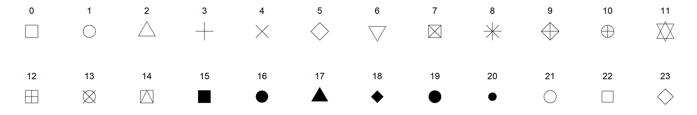

# Visualisation with `ggplot2`

## Core concepts of **grammar of graphics**

__GGPLOT2__^[[https://ggplot2.tidyverse.org/](https://ggplot2.tidyverse.org/)] [@R-ggplot2] is the package developed by Hadley Wickham, which is based on concepts laid (2005) down by Leland Wilkinson in his _The Grammar of Graphics_.^[[https://link.springer.com/book/10.1007/0-387-28695-0](https://link.springer.com/book/10.1007/0-387-28695-0)]  Basically, a grammar of graphics is a framework which follows a layered approach to describe and construct visualizations or graphics in a structured manner. Even the letters `gg` in ggplot2 stand for `g`rammar of `g`raphics.

Hadley Wilkinson, in his paper titled __A Layered Grammar of Graphics__^[[http://vita.had.co.nz/papers/layered-grammar.pdf](http://vita.had.co.nz/papers/layered-grammar.pdf)](2010) [@layered-grammar] proposed his idea of layered grammar of graphics in detail and simultaneously put forward his idea of _ggplot2_ as an open source implementation framework for building graphics.  Readers/Users are advised to check the paper as it describes the concept of grammar of graphics in detail.  By the end of the decade the package progressed^[Version 3.3.0 was released in March 2020] to one of the most used and popular packages in R.

The relationship between the components explained in both the grammars can be illustrated with the following figure^[Source: Hadley Wickham's paper on _the layered grammar of graphics_].  The components on the left have been put forward by Wilkinson whereas those on right were proposed by Wickham.  It may be seen that `TRANS` has no relation in `ggplot2` as its role is played by in-built features of R.

```{r echo=FALSE, fig.cap="Layers in Grammar of Graphics mapped in GGPLOT2", fig.align='center', fig.show='hold', out.height="75%"}
knitr::include_graphics("images/layers_gg.png")
```

Thus, to build a graphic having one or more dimensions, from a given data, we use _seven_ major components -

1. **Data:** Unarguably, a graphic/visualisation should start with a data.  It is also the first argument in most important function in the package i.e. `ggplot(data =)`.
2. **Aesthetics:** or `aes()` in short, provide a mapping of various data dimensions to axes so as to provide positions to various data points in the output plot/graphic. 
3. **Geometries:** or `geoms` for short, are used to provide the _geometries_ so that data points may take a concrete shape on the visualisation.  For e.g. the data points should be depicted as bars or scatter points or else are decided by the provided `geoms.`
4. **Statistics:** or `stat` for short, provides the statistics to show in the visualisation like measures of central tendency, etc.
5. **Scale:** This component is used to decide whether any dimension needs some scaling like logrithmic transformation, etc.
6. **Coordinate System:**  Though most of the time _cartesian coordinate system_ is used, yet there are times when _polar coordinate system_ (e.g. pie chart) or _spherical coordinate system_ (e.g. geographical maps) are used.
7. **Facets:** Used when based on certain dimension, the plot is divided into further sub-plots.

## Prerequisites:

```{r}
library(ggplot2)
```

## GGPLOT2 in action

> Out of the afore-mentioned components, three are to be explicitly provided and thus can be understood as mandatoty components.  These three componenets are `data`, `aesthetics` and `geometries`.  Whilst these three compoenents are mandatorily provided, it is not that others are not mandatory.  basically other componenets have their defaults (e.g. default coordinate system is cartesian coordinate system).  Let us dive into these three essential components and build a plot using these.

### Building a basic plot

We will use `mtcars` datasets, a default dataset to learn the concepts.

See what happens when `data` is provided to `ggplot` function-
```{r fig_blank, fig.height=2, fig.align='center'}
ggplot(data=mtcars)
```

We can see that a blank chart/plot space has been created as our data `mtcars` has now mapped with ggplot2. Now let us provide aesthetic mappings to this using function `aes()`

```{r fig_gg_2, fig.height=2, fig.align='center'}
ggplot(data = mtcars, mapping = aes(x=wt, y=mpg))
```
You may now notice, apart from creating a blank space for plot, the two dimensions provided, i.e. `wt` and `mpg` have been _mapped_ with `x` and `y` axes respectively.  Since no geometry has been provided, the plot area is still blank.  Now we will provide geometry to our dimension say _point_.  To do this we will use another layer of function `geom_*` (`geom_point()` in this case specifically).  

```{r}
ggplot(mtcars, aes(wt, mpg)) +
  geom_point()
```
Notice that another layer has been added to function `ggplot()` using a `+` sign here.  

We could have used another geometry say boxplot here.
```{r}
ggplot(mtcars, aes(y = wt)) +
  geom_boxplot()
```

That's basic architecture of this package. Now lets discuss more on `aesthetics` and `geometries` before moving on to another compoenents.

### More on Aesthetics

Now what if color is provided inside `geom_*` function. 
```{r}
ggplot(mtcars, aes(wt, mpg)) +
  geom_point(color='red')
```
As the argument `color='red'` was mentioned inside the `geom_point()` function, it turned every point to red.  But if we have to pass a vector/column based on which the points should be colored, it should be wrapped within aesthetics function `aes()` -
```{r}
ggplot(mtcars, aes(wt, mpg)) +
  geom_point(aes(color=cyl))
```
Since the `cyl` column was a numeric column, ggplot2 thought it to be a `continuos` column and thus produced a color scale instead of a legend.  We however, know that this is a categorical column here, and thus if we want to produce a color legend we will have to convert it to a factor first.  See now the changes-
```{r}
ggplot(mtcars, aes(wt, mpg)) +
  geom_point(aes(color=as.factor(cyl)))
```
One more thing - `aes()` function wrapped in `geom_point()` function could have been wrapped in `ggplot()` also.  So basically the following code will also produce exactly the same chart-

```
ggplot(mtcars, aes(wt, mpg, color = as.factor(cyl))) +
  geom_point()
```
Two questions arise here - 

1. Is there any difference between the two?

**Ans:** Yes, basically aesthetics if provided under the `geoms`, will override those aesthetics which are already provided under `ggplot` function.  See the result of following command in your console-
```{r}
ggplot(mtcars, aes(wt, mpg, color = as.factor(cyl))) +
  geom_point(color='red')
```

2. What if `color='red'` (or blue) is passed inside `aes()`?

**Ans:** In this case ggplot will try to map it some aesthetics called 'blue'.  Let's see

```{r}
ggplot(mtcars, aes(wt, mpg)) +
  geom_point(aes(color='blue'))
```
Interesting!  GGPLOT2 has not only mapped a dummy variable called `'blue'` with color of points, but also created a legend.  More interestingly the color is not what we wanted.

Different types of aesthetic attributes work better with different types of variables. For example, `color` and `shape` work well with discreet variables, while `size` or `alpha` (transparency) works well for continuous variables. In your console run the following command and check results

```
ggplot(mtcars, aes(wt, mpg, shape=as.factor(cyl))) +
  geom_point()
# OR
ggplot(mtcars, aes(wt, mpg, size=cyl)) +
  geom_point()
# OR
ggplot(mtcars, aes(wt, mpg, alpha=cyl)) +
  geom_point()
```
Multiple aesthetics can be mapped simultaneously, as per requirement.  See this example-
```{r}
ggplot(mtcars, aes(wt, mpg, shape=as.factor(cyl), color=as.factor(gear), alpha=wt)) +
  geom_point()
```

### More on Geoms {#geoms}
In previous section we have seen that as soon as we passed a `geom_*` function/layer to `data` & `aesthetics` layers, the chart/graph was constructed.  Actually, `geom_point()` function, in the background added three more layers i.e. `stat`, `geom` and `position`.  Why?  The answer is simple, `geom_*` are generally shortcuts, which add these three layers.  So in our example, `ggplot(mtcars, aes(wt, mpg)) + geom_point()` is actually equivalent to -
```
ggplot(mpg, aes(displ, hwy)) +
  layer(
  mapping = NULL, 
  data = NULL,
  geom = "point", 
  stat = "identity",
  position = "identity"
)
```
A complete list of geoms available in ggplot2 is given in Annex-

### Faceting

-----------

### More to read

Book [@ggplot22016]

The amount of data also makes a difference: if there is a lot of data it can be hard to distinguish different groups. An alternative solution is to use faceting, as described next.

Note that in ggplot2 `color` aesthetic represent border color of geometry and `fill` aesthetic represent color used to be fill that geometry. 


### Shapes

```{r echo=FALSE, fig.show='hide', message=FALSE, warning=FALSE}
library(tidyverse)
df <- data.frame(
           x = c(0.5,0.5,0.5,0.5,0.5,0.5,0.5,0.5,0.5,
                 0.5,0.5,0.5,0.25,0.25,0.25,0.25,0.25,0.25,0.25,0.25,
                 0.25,0.25,0.25,0.25),
           y = c(1L,2L,3L,4L,5L,6L,7L,8L,9L,10L,
                 11L,12L,1L,2L,3L,4L,5L,6L,7L,8L,9L,10L,11L,12L),
           z = c(0L,1L,2L,3L,4L,5L,6L,7L,8L,9L,10L,
                 11L,12L,13L,14L,15L,16L,17L,18L,19L,20L,21L,22L,
                 23L)
)

df %>% 
  ggplot(aes(x=y, y=x, label=z))+
  geom_point(aes(shape=z), size=7)+
  scale_shape_identity() +
  labs(x="", y="") +
  geom_text(nudge_y = 0.08) +
  ylim(c(0.2,0.6)) +
  theme_void()

ggsave('shapes.png', width = 12, height = 2)
```


```{r shapes, echo=FALSE, fig.cap="Shapes available in GGplot",fig.show='hold', out.width="99%", fig.align='center'}

```

