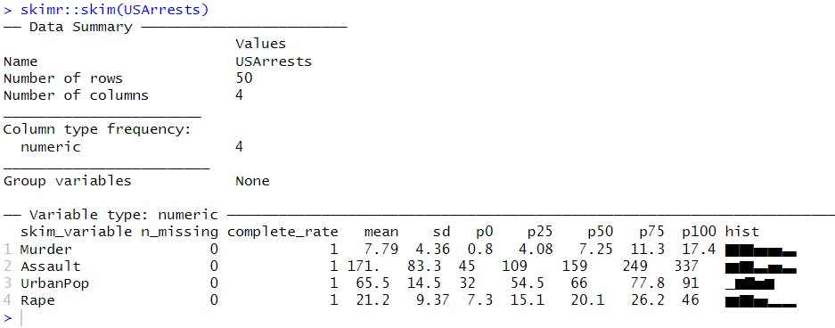

# Part-III: Statistics with R {-}
```{r echo=FALSE, message=FALSE}
library(tidyverse)
```


# Field Statistics (descriptive statistics)
Summary stats
```
library(skimr)
skim(USArrests)
```
```{r skimrr, out.width='50%'}

```

Relationships

```{r warning=FALSE}
suppressMessages(library(PerformanceAnalytics))


USArrests %>% 
  select_if(is.numeric) %>% 
  PerformanceAnalytics::chart.Correlation()
```

More
```{r two-corr, fig.show='hold', out.width="50%", warning=FALSE}
library(GGally)
USArrests %>% 
  select_if(is.numeric) %>% 
  ggcorr(label = TRUE)

USArrests %>% 
  select_if(is.numeric) %>%
  ggpairs()

```


# Simple Linear Regression


# Time Series Analysis
